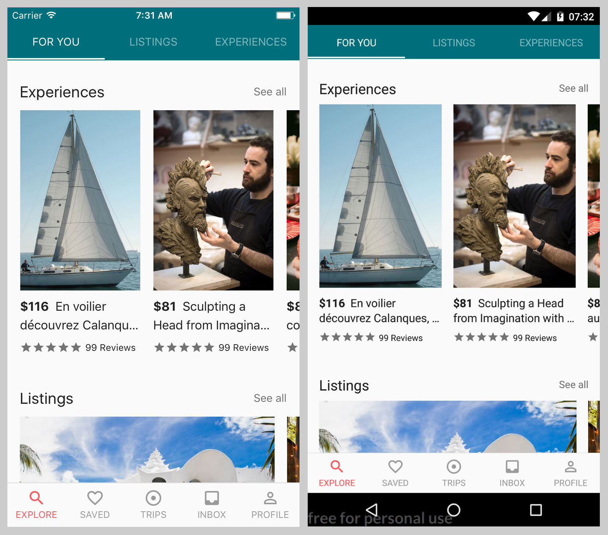

# react-native-workshop

This project is for demo purpose only. It provides: 
- Best practices structure to setup React Native app
- Theme system with [react-native-mdcore](https://github.com/henrytao-me/react-native-mdcore)
- Useful npm scripts
- OTA update with codepush 
- Persist model to store with [redux-persist-model](https://github.com/henrytao-me/redux-persist-model)

## How to run this project? 

1. Setup `react-native` project with Native Code here [[Getting Started]](http://facebook.github.io/react-native/docs/getting-started.html).
2. Run `npm install`.
3. For Android, open project on Android Studio and sync project. Make sure all dependencies are resolved correctly. 
4. For iOS, make sure Xcode and Simulator are ready. 
5. Open terminal 1, run `npm start`.
6. Open terminla 2, run `react-native run-android` (for Android) or `react-native run-ios` (for iOS).
7. Enjoy.

## How does the demo look like? 

Inline-style: 

